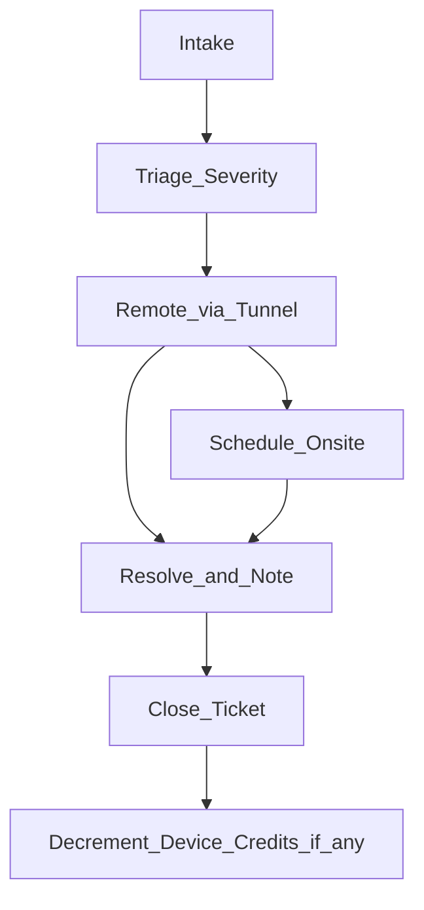

# Support Ticket Process

**Channels:** Email [SUPPORT_EMAIL] · Phone [SUPPORT_PHONE] · (Estate: SMS for P1 only)

---

## Ticket intake

Every request becomes a ticket (even if resolved by phone):

| Field | Required |
|-------|----------|
| Client code / address | Yes |
| Opened by | Client / Provider / Realtor (realtor issues → redirect to client) |
| Channel | Email / phone / SMS |
| Severity | P1 / P2 / P3 (see Concierge SLA) |
| Summary | One line |
| Scope | Covered by Concierge? Credit used? Billable? |

**Tooling:** Start with a shared spreadsheet or simple helpdesk (HubSpot, Freshdesk, or Notion DB). Consistency > fancy.

---

## Severity guide (quick)

| If… | Then |
|-----|------|
| Whole home offline or HA completely unreachable | P1 |
| Single floor / single critical device (lock, primary thermostat) | P2 |
| New bulb, rename dashboard, guest password | P3 |

When unsure, open as P2 and downgrade.

---

## Workflow

1. **Acknowledge** within SLA response time (“We’re on it” counts).  
2. **Remote first** via Tailscale/WireGuard / UniFi.  
3. **Fix or workaround**; if hardware/cable, schedule on-site.  
4. **Close notes:** root cause, prevention, billable hours if any.  
5. **Credits:** decrement new-device credits when applicable.  

---

## Ticket log template (spreadsheet columns)

`id | opened_at | client | severity | summary | tier | status | assignee | responded_at | resolved_at | billable_hours | credit_used | notes`

---

## Escalation

| Situation | Action |
|-----------|--------|
| ISP demarc failure | Document tests; client calls ISP; we stay on for CPE advice |
| Alarm / life-safety | Refer licensed alarm vendor; do not imply we monitor alarms |
| Realtor asking for status | Share high-level only with client CC’d |
| Abuse / credential compromise | P1: rotate Wi‑Fi + admin passwords; notify client |

---

## After-hours

- Essential / Standard: next business day unless client upgrades emergency visit (quoted)  
- Estate P1: best-effort callback; log time  

---

## Quality check (weekly)

Provider reviews open > SLA tickets every Monday; pilots track 14-day ticket counts in `pilots/pricing-refinement-log.md`.
